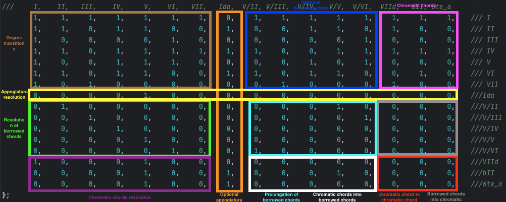

# ChordGenerator
This repository is home to a Constraint project aiming to generate successions of chords respecting the rules of tonal music. It uses [Diatony](https://github.com/sprockeelsd/Diatony) to generate 4 voice textures based on a chord progression generated by this program (in the form of Chord degree - state - quality tuples). It offers "mandatory rules" that are applied by default and that are essential to tonal harmony, as well as optional rules (e.g. forcing cadences at certain points in the progression) that can be used by composer to enforce their personal preferences. It is planned to tie this program to an interface in the future to make it easier to use by composers.

## Structure
The repository is organised as follows: 
- The ***Diatony*** folder is a submodule of the repository of the same name. This allows to control what version of Diatony is used, to make sure that new additions don't break this model.
- The ***headers*** folder contains all the header files inherent to this project. It contains the additional utilities that are not present in the Diatony folder, namely the matrix used for the ChordGenerator constraints.
- The ***out*** folder contains all the generated files.
- The ***src*** folder contains the source code for the ChordGenerator problem, including the constraints definition and a main function showing how the model can be used.

## Makefile
The makefile compiles all the files from the Diatony Library (***todo change that***), and offers different targets:
- clean: removes all generated files.
- compile: executes the "clean" target and compiles all the necessary files, and makes sure that the executable is able to find Gecode.
- run: executes the "compile" target and runs the executable with "false" as an argument, meaning that it does not generate the 4 voice texture.
- 4voice: executes the "compile" target and runs the executable with "true" as an argument, meaning that it generates the 4 voice texture using Diatony.

## Transition matrix
The following image explains the transition matrix that is used by a constraint in the model. It is read as follows: each line corresponds to a chord, and in that line 1 means that the transition from that chord to the one in the column is possible, and 0 means it is not.

The brown box shows all possible transitions between natural degree chords. Combined with the orange box, that shows which chord can go to the fifth degree appogiatura, and the yellow box, that makes sure that appogiatura resolves, they show all possible diatonic chord transitions.

The dark blue box shows possible transitions from diatonic chords to borrowed chords, the light blue box shows possible transitions from borrowed chords to other borrowed chords, and the green box enforces that these borrowed chords resolve.

The pink box shows what chromatic chords can be reached from diatonic chords, the white box shows the possible transitions between chromatic chords and borrowed chords, and the purple box enforces that the chromatic chords resolve.

The grey box shows the transitions between borrowed chords and chromatic chords, while the red box shows the transition between chromatic chords, but both of these are not possible.

